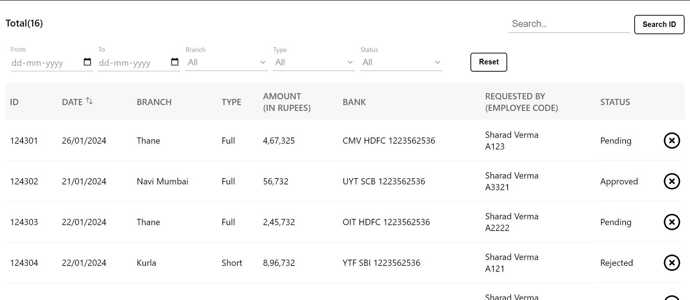

## Admin Panel for Viewing Customer Transactions
    This project is an admin panel designed to view data of transactions paid by the customer. It provides various features such as filtering, sorting, and deleting rows, as well as adhering to validations and design specifications provided in the wireframe.

## Table of Contents
    Features
    Demo
    Setup
    Usage

## Features
    1. View Transaction Data: Display all transaction data in a table format as per the wireframe.
    2. Filtering: Allow users to filter the table using various filters such as ID, date range, branch, type, and status.
    3. Date Range Filter Validation: Ensure that the 'to' date value cannot be less than the 'from' date value.
    4. Sorting: Enable sorting of the date column in ascending and descending order.
    5. Deletion: Provide the option to delete a row by clicking on the delete button.
    6. Dropdown Values: Dynamically adding the values from the data to specific filter fields.
    7. Customization: Allow for additional elements to be added as per requirements.
    
## Demo

## Setup
    # Clone the repository:
        git clone <repository-url>
    # Install dependencies:
        cd admin-panel
        npm install
    #Start the development server:
        npm start
    # Access the application:
        Open your browser and navigate to http://localhost:3000 to view the admin panel.

## Usage
Explain how to use the admin panel, including instructions for filtering, sorting, and deleting rows.